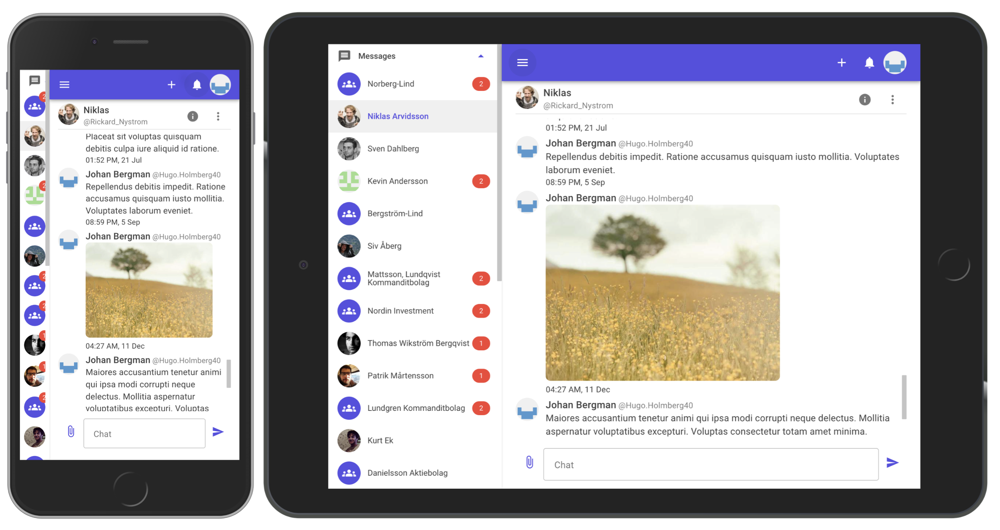

# Chat
This is a chat application built using the .NET Core, providing real-time communication between users. The application uses various technologies in the .NET ecosystem and services of Microsoft Azure to ensure a robust, scalable, and secure solution for enabling seamless interactions.

## Demo

A front-end demo of the app is available at [Netlify](https://chat-frontend-demo.netlify.app)

## Features
* **Real-time Messaging** The app uses [SignalR](https://dotnet.microsoft.com/en-us/apps/aspnet/signalr) of ASP.NET Core to provide real-time messaging functionality. Users can send and receive messages in real-time, facilitating instant communication. In addition to one-on-one conversations, the app also supports multiple chat rooms, allowing users to create, join, and participate in different conversations simultaneously.
* **User Authentication and Authorization**: The app uses [Microsoft Authentication Library](https://learn.microsoft.com/en-us/azure/active-directory/develop/msal-overview) for .NET and [Azure Active Directory B2C](https://learn.microsoft.com/en-us/azure/active-directory-b2c/overview) for a robust, secure, JWT-based user authentication. An [Azure function](https://learn.microsoft.com/en-us/azure/azure-functions/functions-overview?pivots=programming-language-csharp) is used to synchronize the user information between the local database and Azure AD B2C that is triggered via API connectors of the Azure AD B2C user flow.
* **Multimedia Support** Users can also send binary files such as images in addition to text messages. The app uses [Azure Blob Storage](https://azure.microsoft.com/en-us/services/storage/blobs/) to store the files and [Azure CDN](https://azure.microsoft.com/en-us/services/cdn/) to for a rapid content delivering.
* **Standalone front-end demo** The app also provides a standalone front-end demo that can be used to test the user interfaces. The demo uses [Mock Service Worker](https://mswjs.io/) to mock REST and GraphQL responses.

## Build
Specify `b2c_authority` and `b2c_clientid` in Docker build time.
```
docker build -t image_name -f Chat/Serv
er/Dockerfile --build-arg b2c_authority="" --build-arg b2c_clientid="" .
```
Pass environment variables in `.env.example` in runtime
```
docker run image_name -p 8100:80 -e AzureAdB2C__Instance=
"" -e AzureAdB2C__ClientId="" -e AzureAdB2C__Domain="" -e AzureAdB2C__Scopes="" -e AzureAdB2C__SignUpSignInPolicyId="" -e AZURE_BLOB_CONTAINER_NAME="" -e AZURE_STORAGE_CONNECTION_STRING="" -e AZURE_CDN_ENDPOINT_NAME=""
```